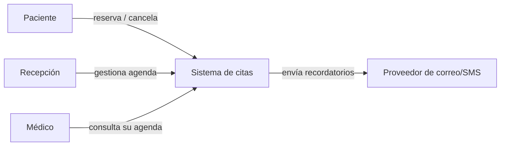
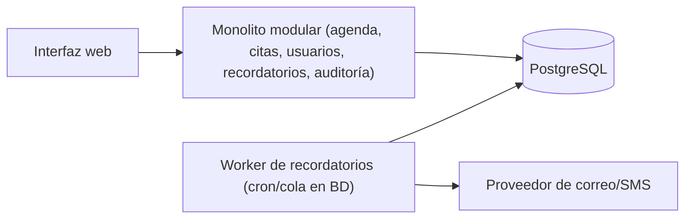
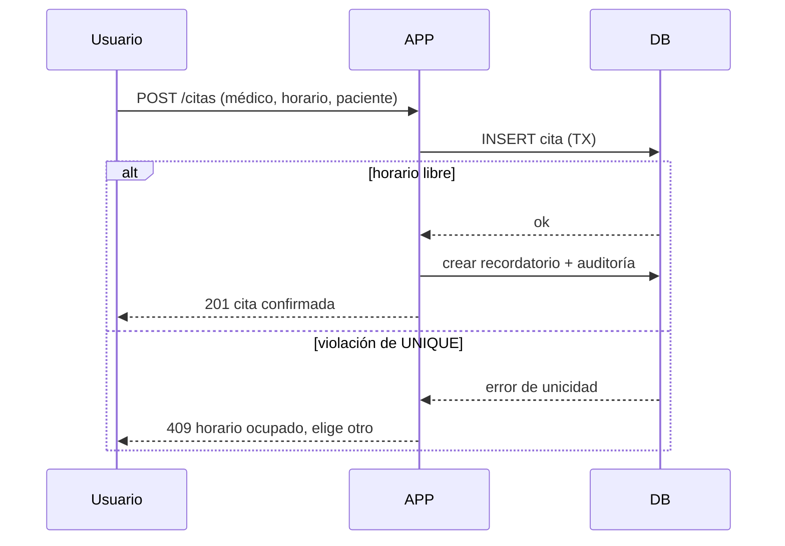

# Ejercicio 3: Citas médicas

## 1. Objetivo, actores y alcance
**Objetivo:** reemplazar teléfono y hojas de cálculo por un sistema que evite reservas duplicadas y garantice recordatorios.

**Actores:** paciente, recepcionista, médico, administrador, proveedor de correo/SMS.

**Alcance (v1):** buscar disponibilidad, reservar, cancelar, recordatorios y auditoría. **Fuera de alcance:** historia clínica, facturación y telemedicina.

## 2. Requisitos
**Funcionales:** RF1 buscar horarios libres por médico y fecha. RF2 reservar. RF3 cancelar. RF4 enviar recordatorios (p. ej. 24 h antes). RF5 reintentar recordatorios fallidos. RF6 auditar.

**Calidad:** consistencia (cero dobles reservas), privacidad (mínimo de datos y acceso por rol), disponibilidad en horario de atención, trazabilidad, usabilidad (encontrar turno en pocos clics).

## 3. C4: Contexto

## 3b. C4: Contenedores

## 4. Flujo crítico: reservar

## 5. Decisiones
**Impedir doble reserva:** la garantía vive en la base de datos, no solo en la interfaz. Índice único parcial: `UNIQUE (medico, fecha, hora) WHERE estado = 'ACTIVA'`. Si dos personas reservan a la vez, una inserción gana y la otra recibe 409. Cancelar libera el horario porque el índice solo cuenta citas activas.

**Datos a guardar:** nombre, documento de identidad (opcional), contacto (correo/teléfono), médico, horario, estado. **No guardar:** diagnósticos, síntomas, resultados ni historia clínica (no se necesitan para agendar y aumentan el riesgo legal y de fuga). Datos de contacto cifrados en reposo en producción.

**Permisos:** Paciente: ve, crea y cancela solo sus citas. Recepción: ve todas, crea y cancela, ve contacto y la auditoría, opera la cola. Médico: ve su propia agenda (nombre y hora), no ve contacto ni documento, no crea ni cancela; puede marcar ausencias. Administrador: usuarios, médicos y horarios. Control por roles (RBAC) en cada endpoint; los accesos denegados se auditan.

**Reintento de recordatorios:** se crea una fila en `recordatorios` (PENDIENTE) al reservar. Un worker la procesa; si el proveedor falla, reintenta con backoff (5 min, 30 min, 2 h), máximo 3 intentos; luego `FALLIDO` y alerta a recepción para llamar. Un recordatorio por cita evita duplicados. Al cancelar la cita, el recordatorio pasa a CANCELADO.

**Auditoría:** quién (usuario y rol), cuándo, acción (reserva, cancelación, ausencia, reserva rechazada por conflicto, acceso denegado, envío/reintento/fallo de recordatorio), cita afectada y detalle. Registro append-only.

## 6. Stack
Monolito modular (Django o Spring Boot: autenticación, ORM y roles ya resueltos), PostgreSQL (restricciones únicas parciales), interfaz web, proveedor de correo/SMS externo. La cola de recordatorios usa la propia base en la primera versión.

## 7. ADR
**ADR-001 (arquitectura): monolito modular.** *Decisión:* una sola aplicación con módulos (agenda, citas, recordatorios, auditoría). *Consecuencias:* despliegue simple y transacciones directas; si el volumen crece, los recordatorios se separan primero.

**ADR-002 (tecnología): restricción UNIQUE parcial en la base de datos para evitar duplicados.** *Decisión:* la integridad se garantiza en la base. *Consecuencias:* sin bloqueos manuales ni condiciones de carrera, a costa de manejar el error 409 en la aplicación.

## 8. Riesgos
| Riesgo | Mitigación |
|---|---|
| Exposición de datos personales | Datos mínimos, RBAC, cifrado, auditoría de accesos |
| Recordatorios que no llegan | Reintentos con backoff, estado visible, alerta a recepción |
| Resistencia al cambio de la recepción | Capacitación breve, interfaz simple, periodo en paralelo con la hoja de cálculo |

## 9. Métricas
**Negocio:** citas duplicadas (meta 0) y ausencias (no-shows).
**Técnica:** % de recordatorios entregados y tiempo para encontrar un turno (las tres primeras se ven en la pantalla).

## 10. Prototipo ejecutable e infraestructura como código
Para correr sin dependencias, el prototipo usa **Python (librería estándar) + SQLite**; el diseño objetivo conserva los mismos contratos. SQLite también soporta el índice único parcial.

| Archivo | Para qué sirve |
|---|---|
| `server.py` | API, roles, índice único parcial, cola de recordatorios, auditoría |
| `index.html` | Interfaz (consume la API) |
| `Dockerfile` | Imagen con healthcheck |
| `docker-compose.yml` | Servicio, puerto 8000 y volumen persistente |
| `.github/workflows/ci.yml` | Construye y prueba `/api/health` en cada push |

**Ejecutar:** `docker compose up --build -d` y abrir el puerto 8000. **Reiniciar datos:** `docker compose down -v`.

**Autenticación:** simulada con la cabecera `X-User` (el selector de usuario de la pantalla). En producción sería JWT o sesión.

**API:** `GET /api/slots?doctor=&date=`, `POST /api/appointments`, `GET /api/appointments`, `POST /api/appointments/{id}/cancel|noshow`, `POST /api/provider {up}`, `POST /api/reminders/process`, `GET /api/reminders|audit|metrics|health`.

**Qué probar:** reserva un horario como Ana y luego intenta el mismo como Luis (409); entra como médico (sin contacto y sin cancelar); como recepción activa "proveedor caído" y pulsa "Procesar cola" 3 veces; revisa la auditoría.
